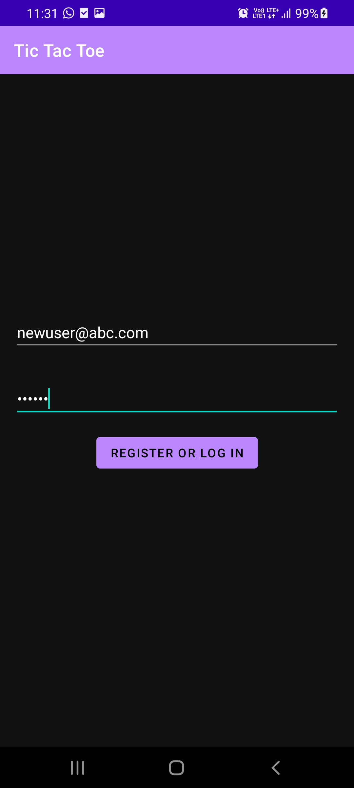
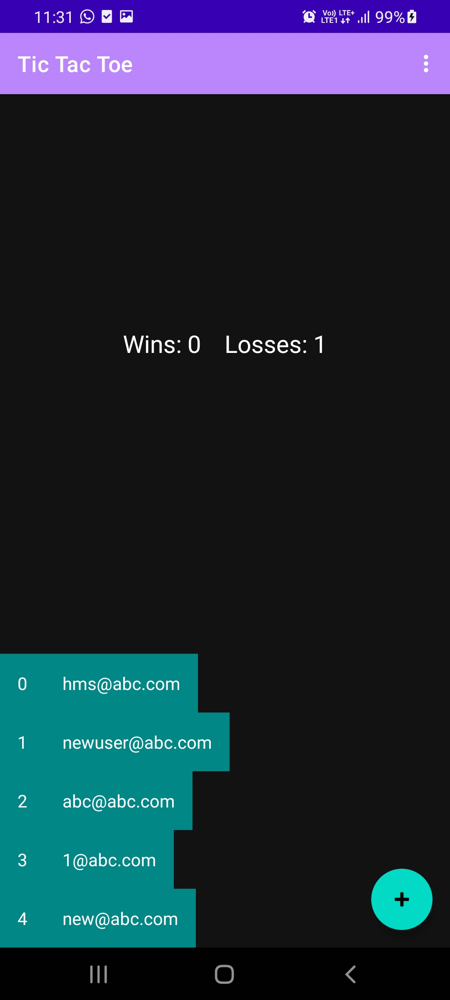

# Tic Tac Toe

This is a starter code for the Tic Tac Toe multiplayer game app assignment.

It uses Android Navigation Component, with a single activity and three fragments:

- The DashboardFragment is the home screen. If a user is not logged in, it should navigate to the
LoginFragment. (See the TODO comment in code.)

- The floating button in the dashboard creates a dialog that asks which type of game to create and
passes that information to the GameFragment (using SafeArgs).

- The GameFragment UI has a 3x3 grid of buttons. They are initialized in the starter code.
Appropriate listeners and game play logic needs to be provided.

- Pressing the back button in the GameFragment opens a dialog that confirms if the user wants to
forfeit the game. (See the FIXME comment in code.)

- A "log out" action bar menu is shown on both the dashboard and the game fragments. Clicking it
should log the user out and show the LoginFragment. This click is handled in the MainActivity.

## a) DETAILS
Project Name: Tic Tac Toe

Name: Harman Marshal Singh

BITS ID: 2018B4A70843G

Email: f20180843@goa.bits-pilani.ac.in

## b) APP DESCRIPTION
### Tic Tac Toe
A single/multiplayer Tic Tac Toe game. A player can chose from a list of open games to be played another player or can create their own 2 player game. 
### Bugs:
  * Register/SignIn button takes some time to authenticate, hence user might press the button multiples times as no information of loading/authenticating is shown.  
### Screenshots:

     

## c) TASKS DESCRIPTION
### Task1: Implementing Sign In:
  * Firebase authentication is used.
  * The user has to enter an email of valid format( xxxx @ xxxx.xxxx ) and password length should be greater than 6.
  * One pressing the register or signIn button, createAccount() function is called. If the email is already registered then the signIn() function is called.
  * It takes one or two seconds to authenticate, depending upon the internet connectivity of the device. 
  * If the authentication is successful, then the wins,losses and email are stored in a sharedPreference file for sharing data amongst fragment and maintaining a cache.
  
### Task2: Single-Player Game:
  * User makes the first move, and a computer player follows. The computer follows a very simple algorithm. It searches the cells linearly and looks for an empty cell, once empty cell is found, it places an 'O' in that cell.
  * After every step, it checked whether the game has reached a terminal state or not. On win/loss, the corresponding wins/losses values of the user are updated in the database. 
  * A list of available cells is maintained. Every time a cell's value is updated, the boolean value for the availabilty is set to false.
  * The listeners can perform the task only if the cell is availabe.
  
 ### Task3: Two-Players Game:
  * Creating a new two-players game:
      i) When a user create a new two-players game by pressin '+' button, a new entry in the database is created.
      ii) In the database we maintain the following information about a game:
            1) Player1's Email: For open games in the dashboard, the email of the first player is shown.
            2) Player2_Joined : This is boolean value used to notify the valueEventListener that the game can start now. 
            3) Last Action: This is the information of opponent's move, used to update the game board on each player's move.
            4) Game State: It tells about the current state of game. If  0: inPlay,  1: Draw,  2: Player1 won, 3: Player1 lost
      
      iii) The code of the adapter is completed, and on the dashboads, currently available games are shown.
  * Joining an open game:  Note::This part of assignment is partially completed (was facing some issues in the recycler view). Only the available games are shown.
  
 
 ## d) Instructions to run the app:
  * On the login fragment, the user has to enter an email of valid format( xxxx @ xxxx.xxxx ,ex: xyz@abc.com) and password length must be greater than 6.
  * After pressing, register/signin button, wait for a few seconds for the authentication process.
  * While playing the single player game, the computer just looks an empty slot and searches linearly, so to see winning results, you can just place X's in the
second/third row. To see losing result, place two X's in the second row and one X in the third row, by this time the computer will complete the first row and win.

## e) Accessibility:
  * Not tested.
## f) Number of hours spent: 25
## g) Difficulty: 8
  
  
  
  
